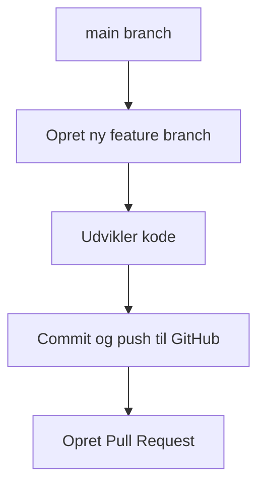
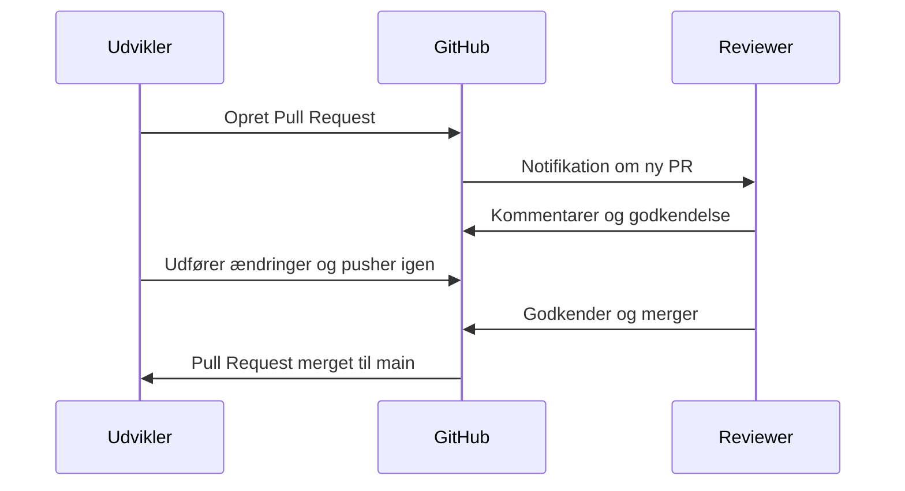

# Hvad er GitHub?

GitHub er en platform til udvikling og samarbejde om softwareprojekter. Den bygger på versionsstyringssystemet Git og gør det nemt at arbejde sammen om kode – både for enkeltpersoner og teams. GitHub bruges af millioner af udviklere verden over og understøtter både open source-projekter og kommercielle applikationer.

## Repositories (eller "repos")

Et **repository** er et opbevaringssted for kode, dokumentation og konfigurationsfiler – altså et projekt. Et repo kan være offentligt (alle kan se det) eller privat (kun inviterede brugere har adgang).

Med GitHub får du:

- Versionshistorik for al kode  
- Mulighed for at arbejde på tværs af grene (branches)  
- Pull requests og code review  
- Issues og projekttavler til opgavestyring  

### ✏️ Illustration: Arbejd med branches og pull requests

## GitHub Actions

**GitHub Actions** er en måde at automatisere arbejdsgange direkte i dit repository. Du kan f.eks. sætte det op til automatisk at:

- Køre tests, hver gang du laver ændringer  
- Udgive en ny version af din app  
- Deploye til en server eller cloud-platform  

Alt sker gennem såkaldte *workflows*, som defineres med YAML-filer. Actions gør det muligt at skabe CI/CD-pipelines uden at skulle bruge eksterne værktøjer.

## GitHub Codespaces

**Codespaces** giver dig en komplet udviklingsmiljø i skyen, som du kan starte direkte fra GitHub. Det er en VS Code-baseret oplevelse med adgang til terminal, debugging, Git og dine filer – uden at du skal installere noget lokalt.

Fordelene ved Codespaces:

- Øjeblikkelig onboarding af nye udviklere  
- Samme opsætning for hele teamet  
- Færre problemer med lokal opsætning og afhængigheder  

## Review og merge af Pull Requests

Når en pull request er oprettet, kan andre på teamet gennemgå koden, kommentere og foreslå ændringer. Når alle er enige, kan ændringerne **merges** tilbage til hovedbranchen (`main` eller `trunk`).

### ✅ Illustration: Gennemgang og merge

## Hvad får man med GitHub Team?

Med en **Team-licens** får du:

- Ubegrænsede private repositories  
- Rollebaseret adgangskontrol  
- Beskyttede branches og avanceret rettighedsstyring  
- 3.000 Actions-minutter pr. måned  
- 2 GB storage til artifacts  
- Teamindsigt med simple rapporter  

Perfekt til mindre teams, der vil have professionel kontrol og samarbejde.

## Hvad får man med GitHub Enterprise?

Med en **Enterprise-licens** får du alt fra Team-versionen – plus:

- Enterprise SSO og SCIM-support (f.eks. Azure AD)  
- Central policy-styring på tværs af organisationen  
- Ubegrænset Actions-minutter og storage (afhængig af aftale)  
- GitHub Advanced Security (code scanning, secret scanning m.m.)  
- Audit logs og compliance-rapporter  
- Support med SLA og dedikeret account management  

Enterprise er velegnet til større organisationer med høje krav til sikkerhed, governance og compliance.

---

## Generet med ChatGPT 4o 

### Prompt 1
> make me a page i can use for explaining what github is all about with focus on repos, actions and code spaces. End by adding a description on what you get for paying for a team license, and what more you get with an enterprise version.. make it in danish

> ### Prompt 2
> kan du inkludere et par mermaid illustrationer som  illustrerer processen med at lave branches, pull request og merges 
