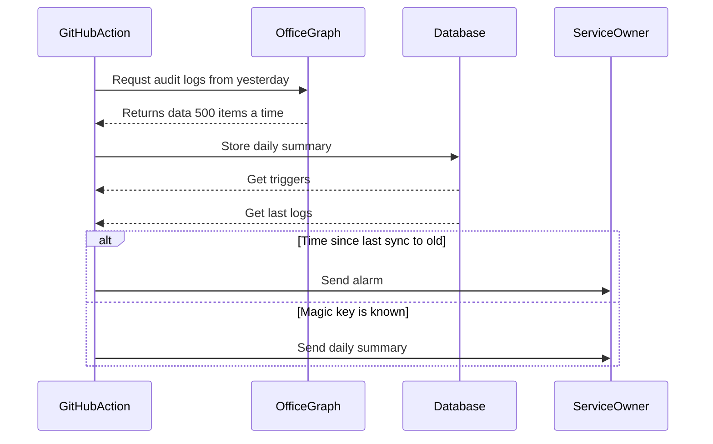
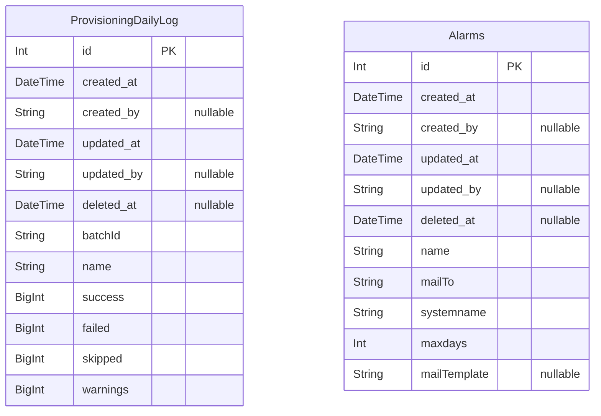

## User Provisioning Monitoring

The readProvisioningAuditLogs function is an asynchronous function designed to read provisioning audit logs from Microsoft Graph API. It accepts an optional options parameter that allows customization of the number of days to look back, the maximum number of pages to read, whether to write the logs to a JSON file, and whether to report errors.

The function begins by initializing an instance of M365AuditLogsApp and retrieves the Microsoft Graph client from it. It then sets up a Map to store unique service principals and their provisioning statuses. The date range for the logs is determined using the getRelativeDateString function, which calculates the start and end dates based on the provided days option.

The function logs the date range being used and prepares to read all pages of audit logs from the auditLogs/provisioning endpoint of the Microsoft Graph API. It uses the readAllPages method to fetch the logs, applying a filter to restrict the logs to the specified date range. The maximum number of pages to read is controlled by the maxPages option, defaulting to 1000 if not provided.

As the logs are read, the function processes each batch of items. It keeps track of the total number of items read and optionally concatenates the items into a data array if the writeToJSON option is enabled. For each item, it extracts the service principal's name and updates the corresponding entry in the uniqueServicePrincipals map with the provisioning status counts (success, failure, skipped, warning).

If an error occurs during the parsing of the data, it logs the error. After processing all pages, if the writeToJSON option is enabled, the function writes the collected data to a temporary JSON file named audit-logs.temp.json.

Finally, the function logs the summary of the provisioning statuses and saves the results to a database using Prisma. It deletes any existing logs for the current batch and inserts the new log entries. Once all entries are saved, it logs a message indicating the number of items saved to the database and prints "done" to the console.

# Data model

> Generated by [`prisma-markdown`](https://github.com/samchon/prisma-markdown)

-    [default](#default)

## default

### `ProvisioningDailyLog`

**Properties**

-    `id`:
-    `created_at`:
-    `created_by`:
-    `updated_at`:
-    `updated_by`:
-    `deleted_at`:
-    `batchId`:
-    `name`:
-    `success`:
-    `failed`:
-    `skipped`:
-    `warnings`:

### `Alarms`

**Properties**

-    `id`:
-    `created_at`:
-    `created_by`:
-    `updated_at`:
-    `updated_by`:
-    `deleted_at`:
-    `name`:
-    `mailTo`:
-    `systemname`:
-    `maxdays`:
-    `mailTemplate`:
